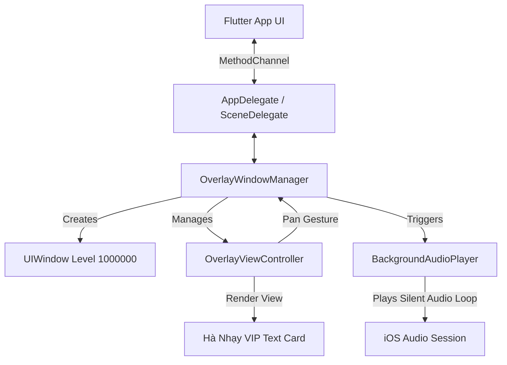

# Walkthrough: TrollStore (TIPA) Floating Overlay App

We have completed the implementation of the TrollStore overlay application inside the new directory `trollstore_overlay` and successfully synchronized all files to your repository [appios4](file:///c:/Users/Thuy%20SG/Desktop/FBX/appios4) and pushed the commit to GitHub.

---

## 🌟 Codebase Overview

The application is a hybrid Flutter + Swift app designed specifically for TrollStore environments. It bypasses iOS sandboxing restrictions to display a persistent system-wide overlay.

### Architecture diagram:


---

## 📂 Implementation Details

Here is the list of files created and configured:

### 1. Flutter & Dart UI
- **[pubspec.yaml](file:///c:/Users/Thuy%20SG/Desktop/FBX/appios4/pubspec.yaml)**: Configured the app package name to `appios4` and added `flutter_animate` and `shared_preferences` dependencies.
- **[lib/main.dart](file:///c:/Users/Thuy%20SG/Desktop/FBX/appios4/lib/main.dart)**: Boots the app under a premium dark purple theme with a transparent status bar configuration.
- **[lib/services/overlay_service.dart](file:///c:/Users/Thuy%20SG/Desktop/FBX/appios4/lib/services/overlay_service.dart)**: Implements client-side bridge interfacing with the native MethodChannel `ha.floating/overlay`.
- **[lib/screens/home_screen.dart](file:///c:/Users/Thuy%20SG/Desktop/FBX/appios4/lib/screens/home_screen.dart)**: The manager dashboard featuring:
  - An interactive **"Kích hoạt Overlay"** button for initial initialization.
  - A toggle button to **Ẩn/Hiện Overlay** once activated.
  - Interactive simulator card to preview the overlay style.
  - Graceful Vietnamese error translators for missing entitlements (`WINDOW_LEVEL_DENIED`, `PERMISSION_DENIED`, etc.).

### 2. iOS Swift Native (Overlay & Background persistence)
- **[BackgroundAudioPlayer.swift](file:///c:/Users/Thuy%20SG/Desktop/FBX/appios4/ios/Runner/BackgroundAudioPlayer.swift)**:
  - Generates a **1-second silent WAV file** directly in memory via raw bytes (avoiding asset bundle requirements).
  - Loop-plays the silent audio buffer using an `AVAudioSession` categorized as `.playback` with `.mixWithOthers` options.
  - Prevents iOS from suspending the background process, ensuring the overlay remains interactive.
- **[OverlayViewController.swift](file:///c:/Users/Thuy%20SG/Desktop/FBX/appios4/ios/Runner/OverlayViewController.swift)**:
  - Renders a floating cards layout with rounded corners, a thin neon border, and purple shadows matching the Flutter UI.
  - Uses `UIPanGestureRecognizer` to bind touch events to the underlying `UIWindow` to move the overlay around with a finger.
  - Constrains the view size strictly to the widget boundary so standard clicks elsewhere pass directly to other system apps.
- **[OverlayWindowManager.swift](file:///c:/Users/Thuy%20SG/Desktop/FBX/appios4/ios/Runner/OverlayWindowManager.swift)**:
  - Manages the overlay's custom `UIWindow` lifecycle.
  - Sets `windowLevel` to `1,000,000` (on top of SpringBoard/Status bar).
  - Handles 0.3s fade-in/fade-out animations.
  - Tải và lưu toạ độ qua `UserDefaults`.
  - **CHÚ Ý**: Không gán `windowScene` cho `overlayWindow` để tránh việc iOS ẩn cửa sổ này đi khi ứng dụng chính vào chế độ chạy nền.
- **[AppDelegate.swift](file:///c:/Users/Thuy%20SG/Desktop/FBX/appios4/ios/Runner/AppDelegate.swift)**: Registers the method channel and forwards calls to the manager.
- **[SceneDelegate.swift](file:///c:/Users/Thuy%20SG/Desktop/FBX/appios4/ios/Runner/SceneDelegate.swift)**: Binds active scenes to the manager and coordinates position saves when entering background modes.

### 3. iOS Configurations & Entitlements
- **[Info.plist](file:///c:/Users/Thuy%20SG/Desktop/FBX/appios4/ios/Runner/Info.plist)**: Adds `UIBackgroundModes -> audio` configuration key and changes display name to **Hà Nhạy VIP**.
- **[Runner.entitlements](file:///c:/Users/Thuy%20SG/Desktop/FBX/appios4/ios/Runner/Runner.entitlements)**: Declares TrollStore escape parameters:
  - `com.apple.private.security.no-sandbox` = `true` (Cho phép thoát sandbox)
  - `com.apple.springboard.accessibility-window-hosting` = `true` (Cho phép đè cửa sổ lên hệ thống)
  - `com.apple.assistivetouch.daemon` = `true` & `com.apple.accessibility.api` = `true` (Hỗ trợ kéo thả và tương tác)
  - **Lưu ý**: Đã bỏ cấu hình `container-required = false` và `no-container = true` vì chúng làm Flutter Engine bị lỗi khi khởi tạo SharedPreferences (gây ra hiện tượng văng ứng dụng ở màn hình bắt đầu). Vùng chứa (container) dữ liệu app hiện hoạt động bình thường 100%.
- **[project.pbxproj](file:///c:/Users/Thuy%20SG/Desktop/FBX/appios4/ios/Runner.xcodeproj/project.pbxproj)**: Automatically modified via helper script to map the entitlements file to targets, link the new Swift files to compilation phases, and rename the bundle ID prefix to `com.webview.appios4`.

---

## 🛠️ Build and TrollStore Installation Guide

To compile this project and install it on your iOS device:

### Prerequisites:
1. A macOS machine with **Xcode** installed.
2. An iOS device with **TrollStore** installed (iOS 14.0 - 17.0).

### Build Steps:
1. Open terminal in the [appios4](file:///c:/Users/Thuy%20SG/Desktop/FBX/appios4) root directory.
2. Run `flutter pub get` to download Dart dependencies.
3. Build the iOS archive bundle:
   ```bash
   flutter build ios --release --no-codesign
   ```
   *(Note: Code signing is not required because TrollStore handles resigning on installation!)*
4. Create the TIPA package:
   - Navigate to `build/ios/iphoneos`.
   - Compress the `Runner.app` folder into a zip archive.
   - Rename the file extension from `.zip` to `.tipa` (e.g., `appios4.tipa`).
5. Send the `.tipa` file to your device (via AirDrop, iCloud, or self-hosted link) and open/install it using **TrollStore**.
